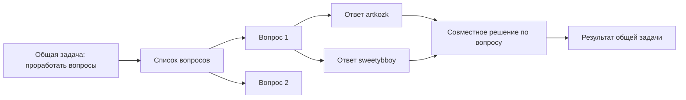

# Business Control: продуктовый gap-анализ и UX-аудит

Дата проверки: 2026-08-13.

## 1. Зачем нужен этот документ

Документ сверяет текущую реализацию Business Control с исходной задачей: двум основателям нужна рабочая система, в которой можно без потерь фиксировать мысли, выполнять и принимать задачи, связывать основания с решениями и восстанавливать ход бизнеса.

Аудит не ограничен замечаниями, которые уже назвал пользователь. Проверены:

1. текущая SQLite-модель и ограничения данных;
2. HTTP API и правила изменения карточек;
3. desktop-интерфейс dashboard, списков и карточки задачи;
4. навигация, терминология и доступность основных действий;
5. соответствие стартовым требованиям из продуктового диалога;
6. сценарий совместной проработки вопросов двумя основателями.

Документ описывает фактическое состояние. Предложенные функции не считаются реализованными, пока они не появились в коде, тестах и production.

## 2. Краткий вывод

Текущая версия уже является общей системой с серверной БД, а не набором локальных заметок. В ней можно создавать карточки, назначать задачи, менять стадии идей, добавлять текстовое доказательство, связывать записи и открывать историю изменений.

Однако продукт пока остаётся универсальным редактором записей, а не понятной моделью работы двух основателей. Главная причина — одна и та же форма используется для восьми разных сущностей. Пользователь вынужден самостоятельно решать, что писать в `Описание`, `Ход работы`, `Результат`, `Доказательство` или произвольный раздел. Свободная связь между карточками технически существует, но не образует управляемый процесс.

Следующий релиз должен исправлять не цветовую схему отдельно, а три базовых слоя:

1. понятные сценарии: захват идеи, личная задача, общая задача, обсуждаемый вопрос и совместное решение;
2. типовые карточки с релевантными полями вместо одинаковой формы для всех сущностей;
3. знакомая навигация, реальные иконки, единая история и короткое обучение при первом входе.

## 3. Что уже работает и должно быть сохранено

### 3.1. Единичность карточки

Идея остаётся одной записью при переходе `Все идеи -> На рассмотрении -> Главная идея/Отклонено`. Данные не копируются, идентификатор не меняется, связи и история остаются у исходного объекта.

### 3.2. Быстрая первичная фиксация идеи

Идею можно создать без оценки и аргументации. По умолчанию она попадает в `Все идеи`. Это соответствует правилу «сначала сохранить мысль, потом оценивать».

### 3.3. Серверная совместная работа

Данные находятся в SQLite на сервере. Есть два аккаунта, длительная сессия, назначение ответственного и видимость общих карточек для обоих основателей.

### 3.4. Базовая задача

У задачи есть ответственный, срок, оценка времени, процент прогресса, заметка о ходе работы, результат и доказательство в виде текста или ссылки. Просрочка вычисляется автоматически, а цвет срока меняется по близости даты.

### 3.5. Аудит и отсутствие пользовательского hard delete

Карточки архивируются с причиной. Публичного API физического удаления карточки нет. Изменения записывают автора и время; для срока и статуса сохраняются значения до/после и обязательная причина. Событие истории открывается в отдельном окне и ведёт к карточке.

### 3.6. Универсальные и индивидуальные разделы

Есть определения разделов по типу карточки и разделы только одной карточки. Отключение универсального раздела не удаляет уже введённое содержание.

### 3.7. Базовые связи и оценки

Любые две карточки можно связать. Карточку можно оценить по критерию от 0 до 10 с пояснением. Эти механизмы полезны как фундамент, но нуждаются в более строгой продуктовой семантике.

## 4. Самостоятельно найденные блокирующие проблемы

### 4.1. Одинаковые поля не подходят разным типам карточек

Идея, критерий, документ, исследование и разногласие получают одинаковый блок `Ответственный / Принимает решение / Срок`. Для части сущностей эти понятия либо не нужны, либо означают разное. В результате форма выглядит как набор полей, а не как подсказка следующего действия.

Исправление: сохранить минимальное техническое ядро записи, но задавать отдельную схему отображения и отдельные рабочие поля для каждого типа. Нерелевантные поля не показывать даже под раскрывающимся пунктом.

### 4.2. Несколько источников истины внутри идеи

В карточке идеи одновременно существуют:

- текстовый раздел `Цели` и структурированные связи с целями;
- текстовый раздел `Критерии отбора` и реальные оценки критериев;
- текстовый раздел `Связанные записи` и реальный список связей;
- текстовый раздел `Решения по идее` и отдельные карточки решений.

Пользователь не понимает, куда вводить данные, а значения могут разойтись. Это нарушает принцип единственного экземпляра не на уровне карточки, а на уровне её фактов.

Исправление: структурированные данные должны отображаться прямо в соответствующем пункте карточки. Текстовые дубликаты необходимо перевести в пояснения или скрыть после миграции содержимого. Старые данные не удаляются.

### 4.3. Отсутствующая оценка ошибочно выглядит как ноль

UI подставляет `0` каждому ещё не оценённому критерию. Ноль означает сознательное решение «совсем не соответствует», а отсутствие оценки означает «ещё не рассматривали». Это разные состояния и они не должны смешиваться.

Исправление: использовать пустое значение `Не оценено`, разрешать явный ноль и показывать полноту оценки, например `3 из 7 критериев`.

### 4.4. Оценка второго основателя перезаписывает оценку первого

В БД действует уникальность `(record_id, criterion_id)`. Новая оценка того же критерия обновляет одну строку и меняет `evaluated_by`. История события остаётся, но на текущем экране нельзя сравнить две независимые позиции.

Исправление: хранить персональные оценки по ключу `(record, criterion, evaluator)` и отдельно рассчитывать командное значение или фиксировать согласованную оценку. Это особенно важно перед выбором главной идеи.

### 4.5. Свободный `relationType` не создаёт процесс

Сейчас смысл связи вводится текстом, по умолчанию `related`. Нет справочника допустимых отношений, направления, проверки полноты цепочки или представления всей цепи. Нельзя отличить `ответ на вопрос` от `основание решения` на уровне поведения системы.

Исправление: оставить универсальную таблицу связей, но добавить системные типы отношений, локализованные названия и правила: `содержит вопрос`, `ответ на`, `решено в`, `порождает задачу`, `подтверждает`, `зависит от`. Пользователь выбирает понятное значение из меню, а не вводит технический текст.

### 4.6. История и Timeline дублируют навигацию

Оба раздела используют один журнал. `История изменений` показывает аудит, а `Timeline / Хронология` добавляет сроки, но для пользователя это выглядит как два одинаковых места.

Исправление: один пункт `История` с переключателем представления `Лента / По времени / Аудит`. Фильтры по типу, человеку и периоду общие.

### 4.7. Старые записи становятся невидимыми после лимита

API возвращает не более 500 карточек и 500 событий без пагинации. Данные в БД не удаляются, но после роста проекта старые записи перестанут находиться через интерфейс. Для требования «ничего не теряется» этого недостаточно.

Исправление: серверная пагинация, полнотекстовый поиск и загрузка следующей страницы. Пользователь должен иметь доступ ко всему архиву, а не только к последним 500 объектам.

### 4.8. Индикатор `Сохранено` вводит в заблуждение

Верхняя надпись `Сохранено` фактически означает завершение общей загрузки данных. Она может отображаться одновременно с несохранённым локальным черновиком открытой карточки. Разделы, оценки и доказательства сохраняются отдельными кнопками и не имеют общего надёжного состояния.

Исправление: глобальный индикатор заменить на состояние соединения (`На связи / Нет сети`). Состояние сохранения показывать рядом с конкретным редактором: `Сохраняется`, `Сохранено в 14:32`, `Есть несохранённые изменения`, `Ошибка, повторить`.

### 4.9. Карточка сразу является формой редактирования

Открытие карточки показывает поля ввода и кнопку сохранения вместо краткого понятного обзора. Это увеличивает риск случайных изменений и делает чтение чужой задачи похожим на заполнение анкеты.

Исправление: по умолчанию режим просмотра. В шапке — статус, ответственный, срок и основные команды. Полное редактирование включается кнопкой `Изменить`; прогресс, статус и ответ можно обновлять отдельными быстрыми действиями.

### 4.10. Карточки открываются только модальным окном

У карточки нет собственного URL, её нельзя открыть ссылкой, закрепить, восстановить после обновления страницы или пройти браузерной кнопкой назад по связанным объектам. Открытие связанной карточки заменяет содержимое того же окна без понятного пути возврата.

Исправление: маршрут `/records/{id}`, breadcrumb и стек переходов. Большая карточка должна быть полноценной страницей; компактный preview допустим для быстрого просмотра.

### 4.11. Завершённые задачи не имеют отдельного фильтра

Статус `Выполнено` существует и ставится через специальную операцию, но вкладки списка задач не содержат отдельного пункта `Выполнено`. Завершённые задачи смешиваются с общим списком.

Исправление: добавить представления `Активные`, `На проверке`, `Выполненные`, `Отменённые`, `Архив`. По умолчанию показывать активные, а не все состояния одновременно.

### 4.12. Ручной прогресс не показывает реальный ход работы

Процент и одна строка `Ход работы` не отвечают на вопросы: что уже сделано, что блокирует, когда был последний апдейт и что осталось. Средний процент по задачам человека не является надёжной оценкой загрузки.

Исправление: чек-лист, короткие обновления прогресса с датой, блокеры, плановая и фактическая трудоёмкость. Загрузка команды должна учитывать сроки и доступную ёмкость, а не только сумму минут.

### 4.13. Нет приёмки результата

Исполнитель с доказательством сразу переводит задачу в `Выполнено`. Постановщик не может принять результат, вернуть на доработку или зафиксировать замечание отдельным действием.

Исправление: поток `Не начато -> В работе -> На проверке -> Принято`; возврат `На проверке -> В работе` требует причины. Доказательства и предыдущие версии остаются в истории.

### 4.14. Важные изменения объясняются не всегда

Причина обязательна для срока, статуса, архива и удаления связи. Изменение текста решения, формулировки цели, шкалы критерия или согласованной позиции может пройти без причины, хотя по исходным требованиям это важнее обычного редактирования описания.

Исправление: правила значимых полей по типу. Для решения обязательны причина и новая ревизия; для цели — изменение результата, метрики или срока; для критерия — шкала, вес и активность. Небольшая орфографическая правка не должна требовать формального обоснования.

### 4.15. История не является полной версией объекта

Журнал показывает изменения, но создание карточки фиксирует не весь исходный снимок, а восстановление версии одной кнопкой отсутствует. Поэтому гарантированно собрать состояние карточки на произвольную дату нельзя.

Исправление: полные ревизии значимых объектов, просмотр версии на дату и команда `Создать новую ревизию на основе этой`. Старую историю нельзя перезаписывать.

### 4.16. Настройка структуры слишком техническая

`Структура карточек` позволяет добавить и включить пункт, но не объясняет его назначение, обязательность, тип значения, подсказку, допустимый этап или порядок через UI. Произвольный раздел одной карточки также нельзя аккуратно вывести из активного использования после ошибочного создания.

Исправление: перенести структуру в `Настройки проекта`, добавить preview, порядок, пояснение, обязательность и тип содержимого. Отключение всегда сохраняет прошлые данные.

### 4.17. Нет onboarding и встроенной справки

Новый пользователь сразу видит 13 пунктов меню и общую команду `Новая карточка`. Интерфейс не объясняет разницу между идеей, задачей, исследованием, разногласием и решением, а также назначение полей `Описание`, `Ход работы`, `Доказательство` и `Результат`.

Исправление: пропускаемый двухминутный onboarding из четырёх шагов, checklist первых действий и команда `Повторить обучение` в профиле. На постоянных экранах остаются только короткие контекстные подсказки у неоднозначных полей; длинная инструкция не должна занимать рабочую область.

### 4.18. Нет рабочего журнала уведомлений и настроек внимания

Уведомление можно только прочитать, а `Прочитать все` уничтожает полезный сигнал без группировки. Нет фильтров `Непрочитанные / Назначения / Сроки / Проверка`, отложить на позже, подписаться на карточку или отключить шумный тип события.

Исправление: центр уведомлений в верхней панели, группировка по карточке, действия `прочитать`, `напомнить позже`, `открыть`, настройки подписок. Системные уведомления о сроках должны быть идемпотентными.

### 4.19. Нет защиты от случайного закрытия длинных редакторов

Черновик есть только у основной формы карточки. Тексты универсального раздела, новый произвольный раздел, критерий, доказательство и будущий ответ на вопрос сохраняются только собственной кнопкой. Закрытие диалога не предупреждает о несохранённом тексте этих редакторов.

Исправление: единый механизм черновиков и dirty-state для всех длинных редакторов, предупреждение перед закрытием, автоматическое восстановление после сети или перезагрузки.

### 4.20. Нет правил доступности и управления с клавиатуры как законченного сценария

В интерфейсе есть базовые labels и `Ctrl+S`, но буквенные маркеры, цветовые индикаторы сроков и сложные модальные окна не образуют проверенный keyboard/screen-reader flow. Цвет не должен быть единственным сигналом срочности.

Исправление: реальные иконки с доступными названиями, текстовое состояние рядом с цветом, управляемый фокус диалогов, Escape с проверкой черновика, shortcuts для быстрого создания/поиска и автоматические accessibility-проверки.

## 5. Обязательный сценарий: общая задача и цепочка вопросов

### 5.1. Почему текущей связи недостаточно

Задача `Составить вопросы до начала совместной работы` сейчас может иметь только одного ответственного. Список вопросов можно положить в описание, план, ход работы, результат или доказательство. Каждый вариант технически допустим, поэтому ни один не является очевидным. Ответы основателей нельзя представить двумя обязательными персональными карточками, а финальное решение система не ждёт и не проверяет.

### 5.2. Целевая цепочка

### 5.3. Как должен работать интерфейс

1. В меню `+ Создать` пользователь выбирает `Общая задача`.
2. Указывает обоих участников, общий срок, ожидаемый результат и приблизительное время каждого.
3. В задаче выбирает тип результата `Список вопросов`.
4. Добавляет вопросы строками или вставляет готовый список. Каждая строка превращается в отдельную карточку вопроса без копирования текста.
5. Система автоматически создаёт по одной персональной карточке ответа на каждого участника либо предлагает добавить участника кнопкой.
6. Каждый основатель видит свои неотвеченные вопросы в `Моя работа`, открывает только свой ответ и отправляет его.
7. Карточка вопроса показывает ответы рядом, но не смешивает авторство.
8. Когда обязательные ответы готовы, появляется действие `Сформировать общее решение`.
9. Решение получает отдельную карточку, автора фиксации, принимающих решение, текст договорённости, причину, дату пересмотра и ссылки на оба ответа.
10. После решений по всем вопросам общая задача переходит на проверку и затем в `Принято`.

### 5.4. Какие объекты необходимы

- `team_task` или задача с несколькими участниками;
- `question_set` как структурированный результат задачи;
- `question` как отдельная карточка;
- `answer` как отдельная карточка с одним автором и одним вопросом;
- `decision` как итог вопроса;
- системные связи `contains`, `answer_to`, `resolved_by`, `result_of`;
- индикаторы полноты `4/7 вопросов имеют два ответа`, `3/7 решений принято`.

Новые объекты не обязаны становиться новыми постоянными пунктами левого меню. Вопросы и ответы могут открываться из общей задачи, `Моей работы`, поиска и связанных решений, чтобы навигация не разрасталась.

## 6. Целевая модель полей по типу карточки

### 6.1. Идея

Главные поля: название мысли, краткая гипотеза, стадия, куратор и дата фиксации.

Структурированные блоки: связанные цели, персональные и согласованные оценки критериев, аргументы за/против, допущения, ограничения, вопросы без ответа, необходимые исследования, связанные решения и следующий шаг.

Срок не должен быть главным полем идеи. Если нужно что-то проверить к дате, из идеи создаётся исследование или задача.

### 6.2. Цель

Главные поля: желаемый результат, измеримая метрика, исходное значение, целевое значение, срок, владелец и статус.

Прогресс должен считаться по метрике или связанным этапам. Ручная корректировка допустима с пояснением. Связанные задачи и идеи показываются отдельными подборками.

### 6.3. Личная задача

Главные поля: действие, постановщик, исполнитель, срок, приоритет, плановая оценка времени и ожидаемый результат.

Рабочие блоки: чек-лист, прогресс-обновления, блокеры, комментарии, доказательства, фактическое время и приёмка. `Описание` хранит контекст и условия; `Ход работы` заменяется лентой обновлений; `Результат` заполняется при отправке на проверку.

### 6.4. Общая задача

Главные поля: общий результат, участники, координатор, срок, оценка каждого и режим завершения.

У каждого участника свой статус и вклад. Общая задача не считается завершённой, пока не выполнены обязательные вклады и не принят общий результат.

### 6.5. Критерий

Главные поля: проверяемый вопрос, описание смысла, шкала `0` и `10`, вес, связанные цели, активная версия и дата пересмотра.

`Ответственный`, общий `Срок` и `Результат` не должны автоматически показываться как поля критерия. Вместо них нужен владелец методики и история версий.

### 6.6. Исследование

Главные поля: исследовательский вопрос или гипотеза, метод, ответственный, срок, источники, наблюдения, уровень уверенности и вывод.

Из вывода можно одним действием создать аргумент, решение или следующую задачу с автоматической связью.

### 6.7. Решение

Главные поля: решаемый вопрос, рассмотренные варианты, выбранный вариант, основания, принимающие решение, дата принятия, дата пересмотра и статус `Черновик / Согласование / Принято / Пересмотрено`.

Изменение принятого решения создаёт новую ревизию с причиной, а не незаметно переписывает старый текст.

### 6.8. Разногласие

Главные поля: предмет, участники, отдельная позиция каждого, согласованные факты, аргументы, нерешённые пункты, способ принятия решения и итог.

Одна общая textarea `Позиции сторон` недостаточна, потому что не сохраняет раздельное авторство и готовность каждой стороны.

### 6.9. Документ

Главные поля: название, категория, текст/файл/ссылка, владелец, версия, дата действия и связанные карточки.

`Принимает решение`, прогресс и универсальный срок не нужны большинству документов. Для регламентов важнее дата вступления в силу и замещённая версия.

## 7. Предлагаемая информационная архитектура

### 7.1. Левое меню

Постоянные пункты должны соответствовать частоте работы:

**Работа**

- `Обзор`;
- `Моя работа`;
- `Задачи`.

**Развитие бизнеса**

- `Цели`;
- `Идеи`;
- `Исследования`;
- `Решения`;
- `Разногласия`;
- `Документы`.

**Контроль**

- `Критерии`;
- `История`.

`Уведомления` переносятся в колокольчик верхней панели. `Структура карточек` переносится в `Настройки проекта`. `Timeline / Хронология` становится режимом единой истории.

### 7.2. Иконки вместо букв

Сокращения `ПР`, `ЦЛ`, `ЗД`, `ИД`, `ИС` не ускоряют распознавание и повторяются. Нужны знакомые иконки из единого набора, например Lucide: `LayoutDashboard`, `Target`, `ListTodo`, `Lightbulb`, `FlaskConical`, `Scale`, `History`, `Settings`.

В раскрытом меню иконка всегда сопровождается текстом. В свёрнутом меню остаётся tooltip с полным названием. Буквенные квадраты полностью убираются.

### 7.3. Верхняя команда создания

Вместо `+ Новая карточка`, которая на dashboard неочевидно создаёт идею, нужна команда `+ Создать` с вариантами:

- `Быстрая идея`;
- `Задача себе`;
- `Задача партнёру`;
- `Общая задача`;
- `Вопрос для обсуждения`;
- `Другая карточка`.

На dashboard рядом нужны три частые быстрые кнопки: `Записать идею`, `Поставить задачу`, `Начать обсуждение`. Тип результата виден до открытия формы.

### 7.4. Главный экран

Счётчики полезны, но первый экран должен отвечать «что делать сейчас»:

1. просроченные и задачи на сегодня;
2. ожидает моего ответа;
3. ожидает моей проверки или решения;
4. задачи партнёра с последним обновлением;
5. активные общие вопросы;
6. быстрый захват идеи;
7. последние принятые решения.

### 7.5. Представления списков

Один объект может показываться в `Списке`, `Доске` и `Календаре`. Это только представления, не копии данных. Выбранный вид и фильтры сохраняются для пользователя.

### 7.6. Визуальная выразительность без декора ради декора

Текущая нейтральная основа пригодна для рабочего инструмента, но ей не хватает смысловой иерархии. Улучшение должно включать:

- крупный понятный заголовок объекта и одну главную команду;
- узнаваемые иконки и аватары;
- цвет только для статуса, срока, блокера и результата;
- пустые состояния с конкретным действием;
- короткие пояснения под новым или неоднозначным полем;
- относительные даты `сегодня`, `завтра`, `просрочено 2 дня`;
- устойчивые размеры строк и отсутствие отдельной прокрутки длинного sidebar на обычном desktop;
- режим чтения карточки вместо постоянной анкеты.

## 8. Чего не хватает из исходных целей

Обозначения: `Готово`, `Частично`, `Нет`.

| Исходное пожелание | Состояние | Фактическое ограничение |
|---|---|---|
| Новая самостоятельная программа с БД | Готово | Отдельный Go-сервис и SQLite работают независимо от основного продукта. |
| Быстро записать любую сырую идею | Готово | Идея создаётся в `Все идеи` без обязательной оценки. Быстрый capture всё ещё требует открытия общей формы. |
| Одна карточка меняет этап без копирования | Готово | Статус меняется у одной записи. |
| Автоматические списки идей по стадии | Готово | Есть вкладки `Все идеи`, `На рассмотрении`, `Главная`, `Отклонено`. |
| Все перечисленные раскрываемые пункты идеи | Частично | Текстовые разделы есть, но часть дублирует структурированные связи и оценки. |
| Универсальные и изменяемые пункты карточек | Частично | Можно добавлять и отключать разделы, но нет полноценной схемы, подсказок, обязательности и удобной сортировки. |
| Критерии формируются из целей | Нет | Критерии создаются вручную; нет процесса вывода, версии, веса и обязательной связи с целью. |
| Каждая идея проходит критерии | Частично | Оценка есть, но не обязательна для перехода; `не оценено` смешано с нулём; оценки партнёров перезаписываются. |
| Сравнение направлений и идей | Нет | Нет матрицы, весов, рейтинга и сравнения рядом. |
| Причины принятия и отклонения решений | Частично | Причина стадии идеи сохраняется; содержание и новая версия принятого решения могут измениться без обязательной причины. |
| Раздельные позиции сторон в разногласии | Нет | Есть одна общая текстовая секция, но нет персональных авторских позиций. |
| Аргументы сторон и итоговое решение | Частично | Текстовые секции есть, но аргумент не является структурированным объектом и не связан с автором/источником. |
| Цепочка цель -> критерий -> идея -> исследование -> решение -> задача -> результат | Частично | Произвольные связи существуют; нет системной семантики, дерева цепочки, полноты и удобного создания следующего объекта. |
| Один объект связан с несколькими | Готово | Many-to-many связи поддерживаются. |
| Кто, когда и что изменил | Готово для базовых действий | Журнал и карточка события есть. После 500 событий старые записи недоступны через UI. |
| Что было, что стало и почему | Частично | Для основных обновлений есть before/after; причина обязательна не для всех важных полей; полного снимка версии и восстановления нет. |
| Нельзя бесследно удалить | Готово на уровне публичного API | Карточки архивируются, связи деактивируются. Нужна offsite-копия для защиты от потери сервера. |
| Даты, сроки и статусы целей/задач | Готово базово | Есть срок и статусы; нет этапа приёмки и календарного планирования. |
| Причина переноса срока или цели | Частично | Причина срока/статуса обязательна; изменение метрики или формулировки цели не выделено как значимое. |
| История развития проекта по времени | Частично | Есть журнал и Timeline, но они дублируются; нет периодов, этапов, milestones и пагинации. |
| Автор, ответственный, изменивший, принимающий решение | Частично | Поля и actor существуют; нет reviewer, нескольких исполнителей и реальной проверки полномочий принятия. |
| Отдельные разделы в левом меню | Готово формально | Меню перегружено, использует бессмысленные буквы и содержит дублирующие служебные пункты. |
| Цель: срок, статус, прогресс | Готово базово | Прогресс ручной, не рассчитывается по метрике или связанным задачам. |
| Идея: оценка, аргументы, исследования, цели, решения | Частично | Всё можно сохранить, но часть данных — свободный текст, часть — связи; нет единого понятного обзора. |
| Задача: ответственный, срок, статус, результат, история | Готово базово | Не хватает приоритета, чек-листа, обсуждения, приёмки, фактического времени и вложений. |
| Два аккаунта с быстрой регистрацией и долгой сессией | Готово базово | Нет email-проверки по исходному решению; остаются риск захвата разрешённого логина и отсутствие восстановления пароля. |
| Каждый ставит задачу себе | Готово | Создатель может выбрать себя ответственным. |
| Видно задачи и оценку времени каждого | Частично | Есть количество и сумма минут, но нет календарной ёмкости, приоритета и фактического времени. |
| Выполнение требует доказательство | Готово базово | Требуется текст или ссылка; файлов нет; приёмки результата нет. |
| Уведомить партнёра о выполнении | Готово | Есть внутреннее уведомление и ручная команда уведомить. |
| Уведомление о назначении и приближении срока | Нет | Нет автоматических событий назначения, завтра/сегодня/просрочено. |
| Цвет срока и общая видимость просрочки | Готово | Состояние вычисляется для обоих пользователей. |
| Смотреть ход выполнения партнёра | Частично | Видны процент и короткая заметка; нет ленты обновлений, чек-листа и блокеров. |
| Общая задача двух основателей | Нет | У записи только один owner; отдельной команды создания общей задачи нет. |
| Список вопросов -> вопрос -> два ответа -> общее решение | Нет | Нет типов вопроса/ответа, персональных ответов, обязательной полноты и автоматической цепочки. |
| Комментарии, обсуждение и упоминания | Нет | Карточка не имеет диалога. |
| Файлы и документы внутри системы | Нет | Поддерживаются текст и внешние ссылки, но не upload/versioned storage. |
| Полнотекстовый поиск по всему проекту | Нет | Текущий поиск ограничен названием/описанием загруженных карточек. |
| Экспорт и независимое восстановление проекта | Нет | Нет пользовательского JSON/CSV/читаемого архива и offsite-backup. |

## 9. Приоритетный план улучшений

### Этап 0. Надёжность данных и понятные базовые состояния

1. Пагинация карточек и истории вместо скрытого лимита 500.
2. Offsite backup с integrity-check и тестом восстановления.
3. Одноразовые приглашения вместо свободного захвата логина из allowlist.
4. `Не оценено` отдельно от `0`; персональные оценки критериев.
5. Разделение индикатора соединения и сохранения конкретной формы.
6. Черновики/autosave для длинных разделов и ответов.

Этап обязателен первым, потому что система должна сохранять бизнес-память до расширения интерфейса.

### Этап 1. Ежедневная работа основателей

1. Иконки вместо букв, группировка меню, единая `История`.
2. `+ Создать` с быстрыми действиями и явной `Общей задачей`.
3. Страница `Моя работа`.
4. Типовая карточка задачи, приоритет, чек-лист и обновления прогресса.
5. Уведомления о назначении и сроках.
6. Приёмка `На проверке -> Принято/Вернуть`.
7. Комментарии и упоминания.
8. Режим просмотра карточки и собственный URL.

### Этап 2. Первая рабочая бизнес-цепочка

1. Общая задача с несколькими участниками.
2. Структурированный список вопросов.
3. Отдельные карточки вопросов и персональных ответов.
4. Сравнение ответов рядом.
5. Итоговое совместное решение и контроль полноты цепочки.
6. Создание следующей задачи из решения с автоматической связью.

Этот этап приоритетнее Kanban и декоративного редизайна, потому что он закрывает уже существующую реальную работу партнёров.

### Этап 3. Обоснованный выбор идей

1. Типовые карточки цели, идеи, критерия, исследования, решения и разногласия.
2. Матрица идей по критериям с весами и персональными оценками.
3. Раздельные позиции в разногласии.
4. Версии принятых решений и значимых целей/критериев.
5. Визуальная цепочка основания -> решение -> действие -> результат.

### Этап 4. Масштабирование удобства

1. Kanban и календарь как представления существующих объектов.
2. Сохранённые фильтры, теги и полнотекстовый поиск.
3. Вложения с безопасным хранением и backup.
4. Шаблоны и повторяющиеся задачи.
5. Экспорт JSON/CSV и читаемый архив проекта.

## 10. Что не стоит добавлять сейчас

Пока не нужны CRM продаж, бухгалтерия, сложные роли десятков сотрудников, публичный портал, AI-оценка идей и большая сеть интеграций. Они не исправят неясность текущих карточек и будут конкурировать с основным бизнесом за время разработки.

## 11. Definition of Done следующего продуктового релиза

Релиз нельзя считать завершённым только по наличию новых полей. Минимальные критерии:

1. новый пользователь без объяснений находит создание личной и общей задачи;
2. в меню нет буквенных заменителей и дублирующих разделов истории;
3. идея, задача, критерий и решение показывают разные релевантные формы;
4. пустая оценка не равна нулю, две оценки основателей не перезаписывают друг друга;
5. для задачи понятна разница контекста, текущего обновления, доказательства и результата;
6. общая задача позволяет создать список вопросов и отдельные ответы обоих основателей;
7. финальное решение связано с вопросом и обоими ответами автоматически;
8. назначение, приближение срока и отправка на проверку создают уведомления без дублей;
9. старые карточки и события доступны после 500 записей;
10. desktop и mobile сценарии проверены визуально и интеграционными тестами;
11. onboarding можно пропустить и повторно запустить из профиля;
12. документация текущего поведения, миграции и восстановления обновлена без удаления истории.

## 12. История документа

### 2026-08-13

Создан полный gap-анализ после проверки кода и фактического desktop-интерфейса. Добавлены найденные без подсказки пользователя проблемы: двойные источники истины, смешение нулевой и отсутствующей оценки, перезапись оценки партнёра, скрытый предел 500 записей, противоречивый индикатор сохранения, отсутствие фильтра выполненных задач, отсутствие собственных URL карточек и неполная версионность.

Отдельно зафиксирован первый обязательный сквозной процесс двух основателей: `общая задача -> список вопросов -> вопрос -> два персональных ответа -> совместное решение -> результат`.

## 13. Актуализация аудита после релиза карточек вопросов

Этот раздел не удаляет исходные выводы аудита, а фиксирует, какие разрывы закрыты в актуальной версии 2026-08-13.

Реализовано:

- буквенные коды меню заменены иконками, а навигация сгруппирована;
- `История изменений` и `Хронология` объединены;
- на обзоре и в общей кнопке создания появились явные сценарии идеи, задачи и обсуждения;
- форма карточки зависит от типа и больше не показывает нерелевантного принимающего решение у идеи или срока у критерия;
- событие истории открывается в отдельной карточке с подробностями и переходом к объекту;
- добавлено пропускаемое четырёхшаговое обучение первого входа;
- реализована цепочка `группа вопросов -> вопрос -> личный ответ каждого основателя -> совместный итог`;
- итог выбирается из ответа или формулируется отдельно;
- полнота ответов и автоматический прогресс проверяются сервером;
- типы связей выбираются из понятного фиксированного списка.

Не закрыто и сохраняет приоритет:

- общая задача с несколькими исполнителями и отдельным вкладом каждого;
- персональные оценки критериев и состояние `Не оценено` отдельно от нуля;
- приоритет, чек-лист, фактическое время, комментарии и приёмка результата задачи;
- напоминания о назначении, приближении срока и просрочке;
- вложения файлов и версионное хранилище документов;
- отдельный URL конкретной карточки и конкретного вопроса;
- создание задачи из решения с автоматической связью;
- offsite backup, пользовательский экспорт и тест восстановления;
- приглашения вместо занятия свободного логина из allowlist;
- пагинация и полнотекстовый поиск по содержимому разделов, ответов и решений.

Подробности реализованного релиза: `docs/product/BUSINESS_CONTROL_QUESTION_WORKFLOW_AND_UI_RELEASE_2026_08_13.md`.
